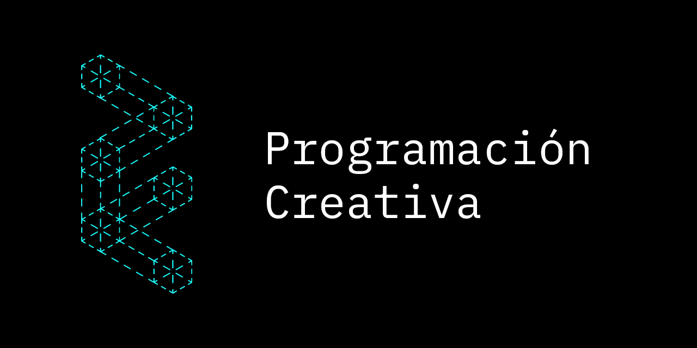

# Programación Creativa con JavaScript

Este espacio lo vamos a utilizar como introducción a la programación creativa.

A veces tiene ejercicios que van adquiriendo complejidad y a veces es un mapa al cual acudir para crear un proyecto artístico con programación.

A veces avanzamos por pasos y a veces avanzamos por tangentes.

A veces es de estructura jerárquica y a veces es rizomática.

A veces los guío y a veces los motivo a proponer derivas.

A veces les ayudo y a veces los instigo.

Los ejercicios quedan publicados en: https://enflujo.github.io/programacion-creativa/

## Contenido

- [Glosario](/Glosario.md)
- [Plantillas](/plantillas)
- [Ejercicios](/ejercicios)
- [Tutoriales]('/tutoriales')

## Ejercicio 1: Instalar herramientas

Configurar su computador instalando las herramientas necesarias. Ver [Herramientas de desarrollo](/tutoriales/general/herramientas-desarrollo.md)

## Ejercicio 2: Entrar al taller

El trabajo lo vamos a realizar en este repositorio de Github. Pare eso debemos aprender un poco del trabajo con "Git".

Continuando con la lógica anterior, deben buscar en Internet cómo hacer lo siguiente:

1. Definir su nombre de usuario y correo electrónico en git (Pista: `git config --global...`)
2. Crear una copia de este repositorio en su propia cuenta de Github. (fork)
3. Crear una nueva rama que se llame: `hola-soy-juancg` reemplazando `juancg` por su nombre. (branches)
4. Escribir su nombre en la lista de miembros en este documento.
5. Publicar ese cambio en su copia del repositorio. (Stage, Add, Push)
6. Enviar los cambios a este repositorio para ser revisado. (Pull request)
7. Eliminar la rama que crearon para este ejercicio.

## Ejercicio 3

Ir a [Glosario](Glosario.md)

## Miembros

- ..:: Juan Camilo González ::..
- ..:: Antonia Bustamante ::..
- ..:: Jeanniffer Pimentel ::..
- ..:: Hugo Idárraga ::..
- ..:: Lina Orejuela ::..
- ..:: Julián García ::..
- ..:: João Gabriel Almeida ::..
- ..:: Fabio o Ferio o F Bonfanti Ruggiero ::..
- ..:: Alejo Forero ::..
- ..:: Andrea Muñoz Álvarez ::..
- ..:: Julian Perez ::..
- ..:: Elisa Ramona Suarez ::..
- ..:: Daniel Hoyos Quiñones ::..
- ..:: Paula Alejandra Salazar 💩::..
