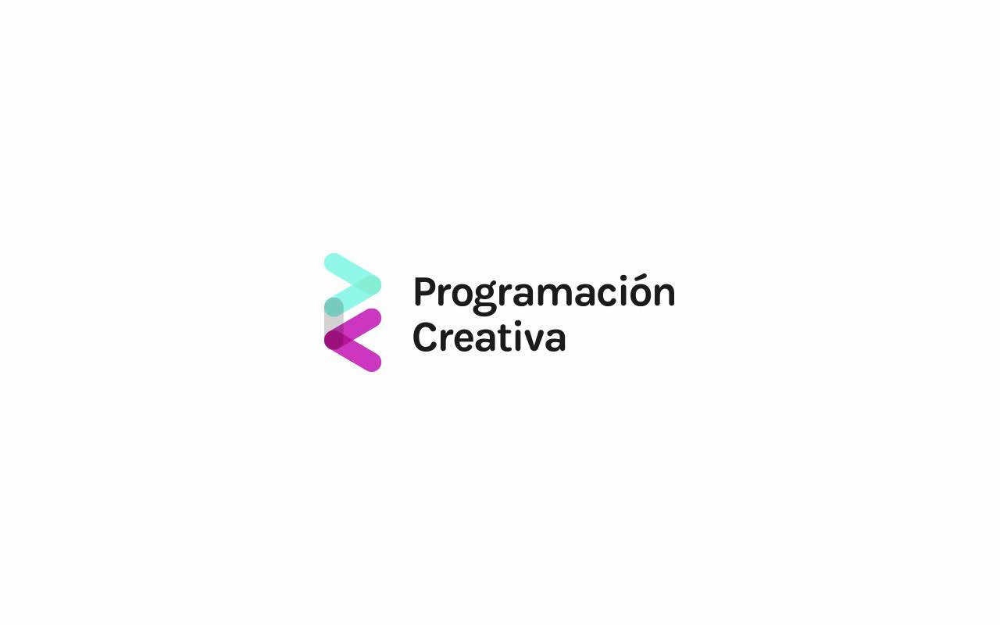
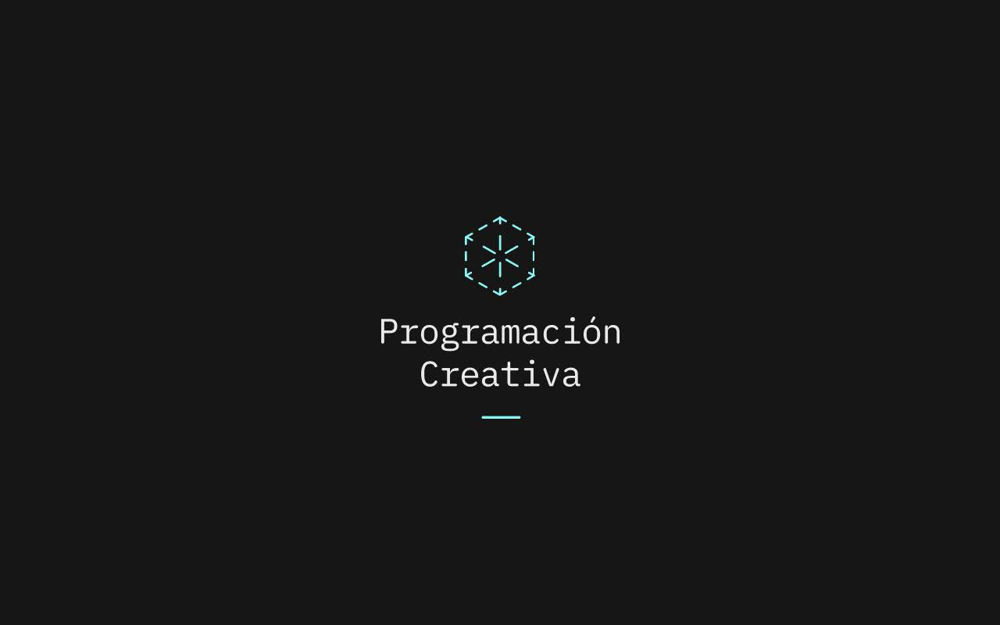
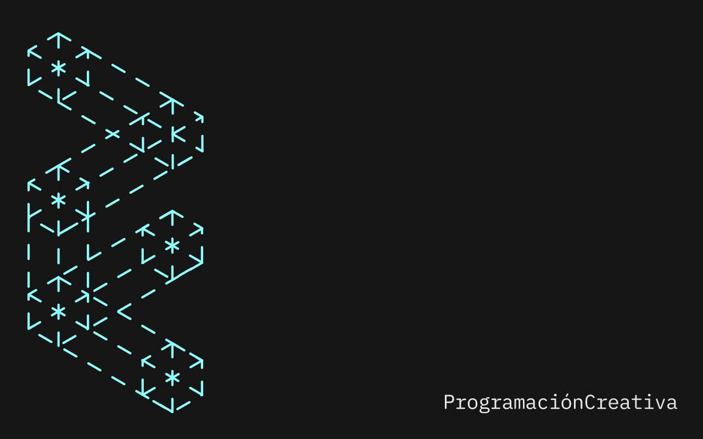
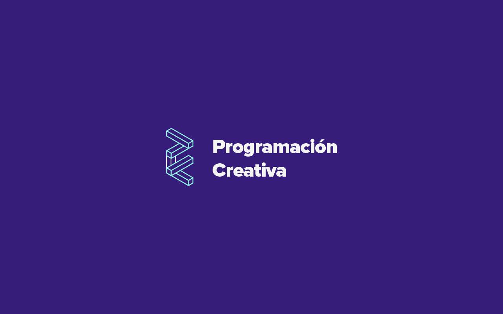
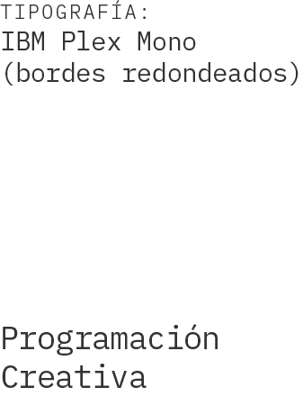
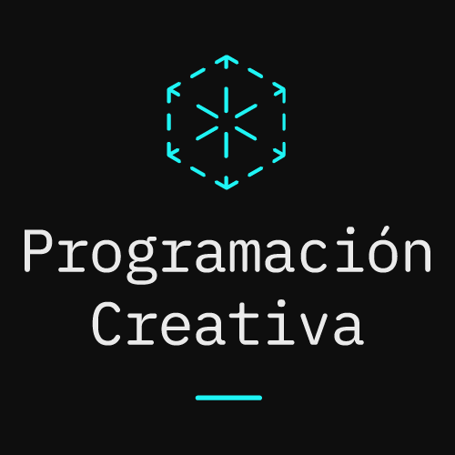
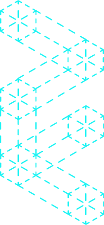
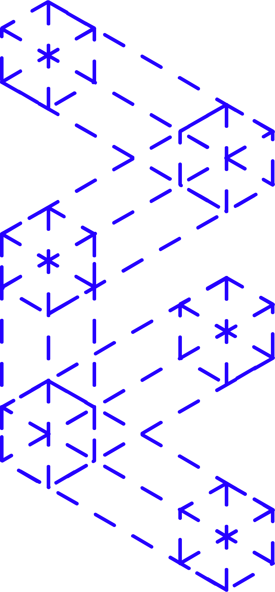

# Logo Programación Creativa

¡Gracias a @jeanniffer por crear el logo del grupo! En este ejercicio los invito a jugar libremente con el diseño del logo usando el Canvas. La idea es que jueguen con las formas que propone el logo y pueden animarlas, hacer dibujo generativo o de alguna forma hacerlo vivo y "EnFlujo".

## Estas fueron las diferentes versiones

## Estas son las guías del diseño final

