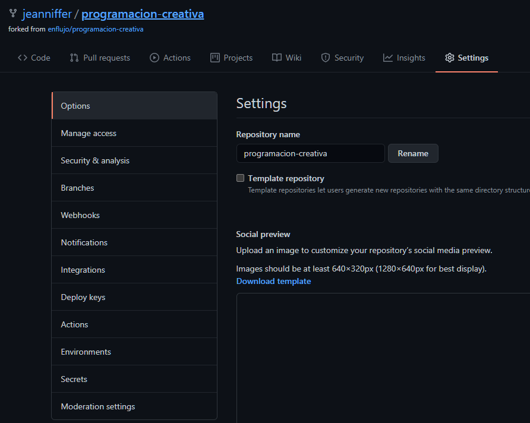
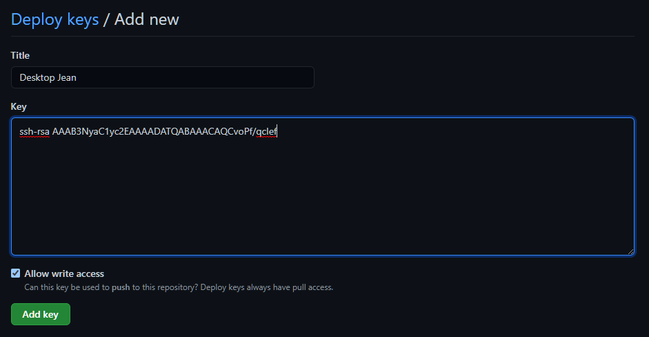
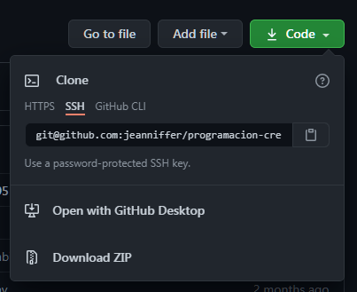

## Llave SSH
SSH (siglas para Secure Shell) es un protocolo de seguridad que vincula nuestra computadora con un repositorio específico sin necesidad de ingresar nuestros datos de inicio de sesión en cada push.
El protocolo se activa con cuatro pasos:
1. Generar una llave
2. Agregar llave al ssh-agent
3. Vincular llave a la cuenta de Github
4. Reemplazar el origen de HTTPS a SSH

---

### Crear una llave SSH
Escribir en la terminal el comando para generar una nueva clave junto a tu correo de Github
```bash
$ ssh-keygen -t rsa -b 4096 -C "correo-de-github@correo.com"
```
Respuesta ideal
```bash
> Generating public/private rsa key pair.

# Y una serie de preguntas:
# NOTA: La clave (que son un par de archivos) siempre se guardarán en la ruta que tengas abierta en la terminal, esta respuesta le dará nombre a los archivos. Yo los nombré programacion-creativa
Enter file in which to save the key (/c/Users/Jeanniffer Pimentel/.ssh/id_rsa): programacion-creativa

# Y una contraseña (que puede ser dejada en blanco)
Enter passphrase (empty for no passphrase):
Enter same passphrase again:

# La respuesta de la consola va a ser un hash junto a tu correo de Github.
```
Ahora puedes buscar en el explorador los archivos con el nombre especificado. Hay que cortarlos y pegarlos  en la siguiente ruta `C:\Users\Jeanniffer Pimentel\.ssh`


### Vincular la clave SSH con Github
- Correr el comando ```$ eval `ssh-agent -s` ``` en la consola 
- Abrir el archivo de extensión .pub en VSCode. 
- Copiar el texto que luce algo así pero con más caracteres: 
```bash 
ssh-rsa AAAB3NyaC1yc2EAAAADATQABAAACAQCvoPf/qcIef
```
- Entrar a nuestro fork del repositorio de programación-creativa. Ir a Settings -> Deploy Keys



- Agregar un titulo (que identifique la computadora usada preferiblemente), y la llave que teniamos copiada


- !IMPORTANTE: marcar el checkbox Allow write access
- Clic en Add Key

### Reemplazar nuestro origen de https a la llave ssh
En caso de tener el origen de la carpeta vinculado a la antigua dirección HTTPS (revisar ejecutando ```git remote -v```) reemplazar con la dirección SSH de nuestro fork. Se encuentra en:



Ejecutar el comando `git remote set-url origin` junto al enlance, en mi caso:
```bash
$ git remote set-url origin git@github.com:jeanniffer/programacion-creativa.git
```
En este punto, hacer un push para asegurarse de que todo esté funcionando correctamente.

## NOTAS: 
- Es importante hacer el proceso completo para no tener problemas de autenticación.
- En caso de ser un repositorio al que se tiene acceso como colaborador, pero no a la configuración, el administrador puede agregar las claves de cada miembro. 
- Un mismo repositorio puede tener varias llaves (por ejemplo, varias computadoras con acceso)